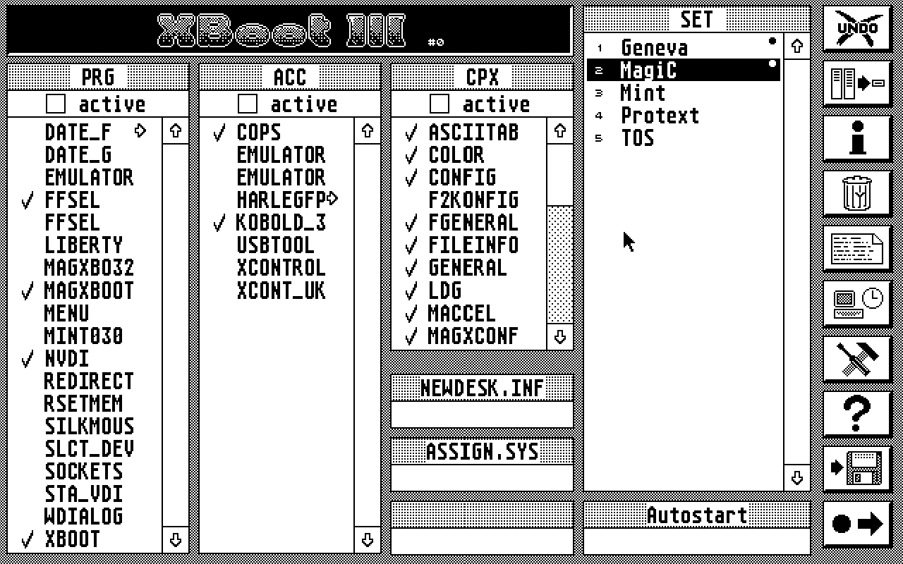

Utilities
===========
XBoot III
--------

Standard Markdown provides no way to influence the layout of your resulting website, like floating of images. To enable you to do so anyway, MDwiki interprets the presence (or absence) of blank lines between images and paragraphs in a special way that allows text flows like in newspapers.

- - - -

Another Utility
--------
