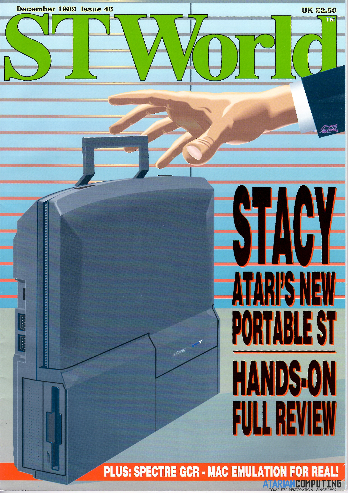
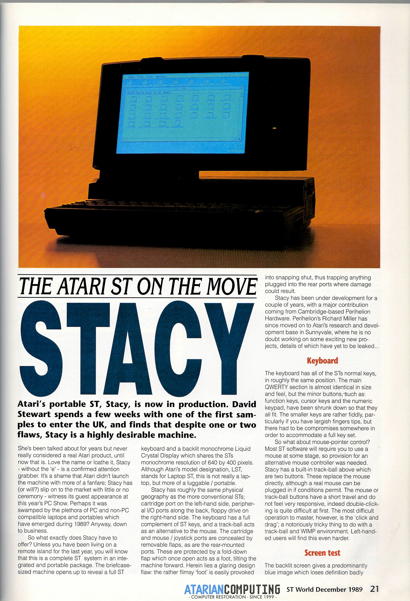
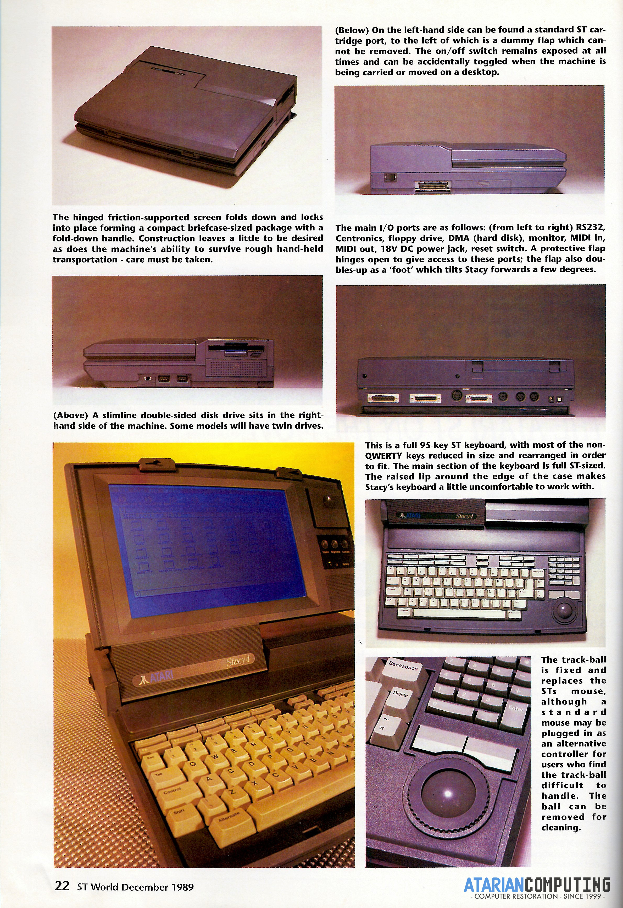
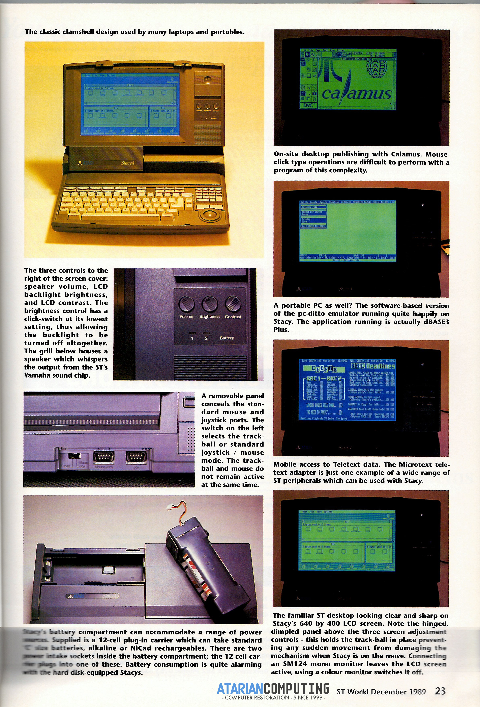
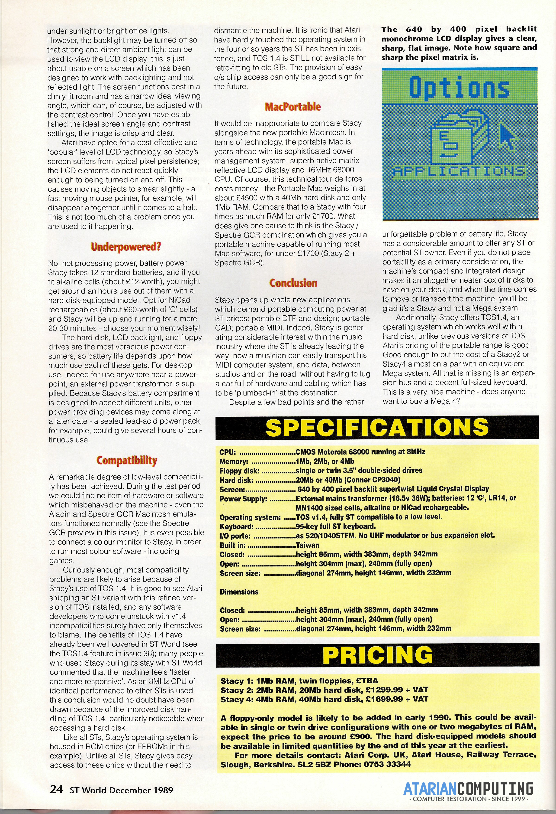
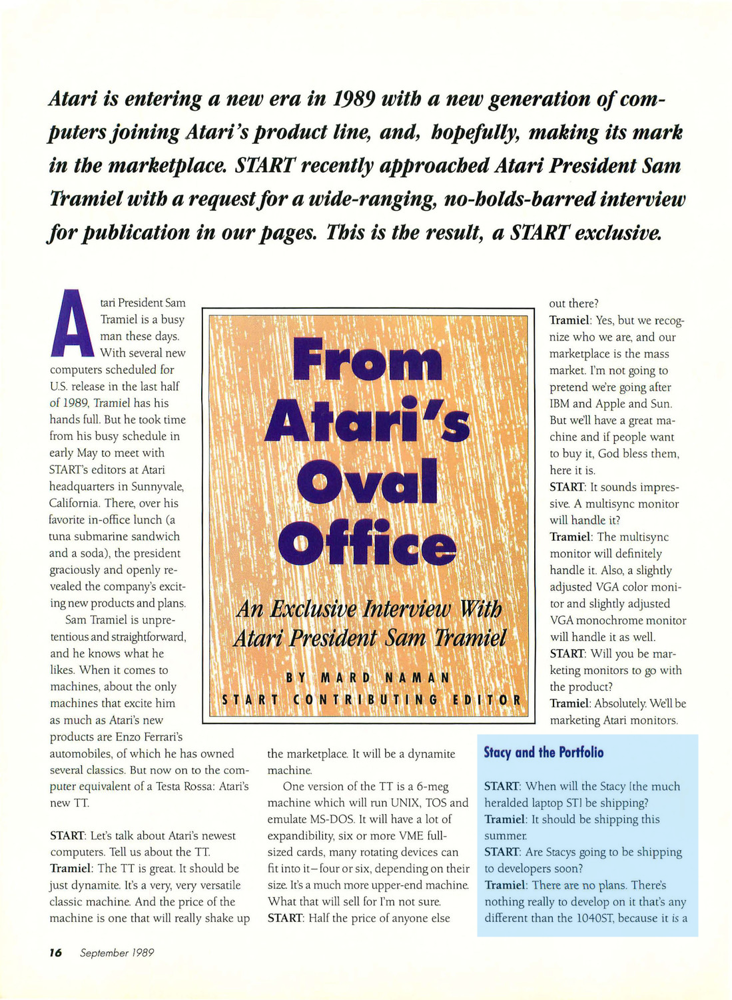
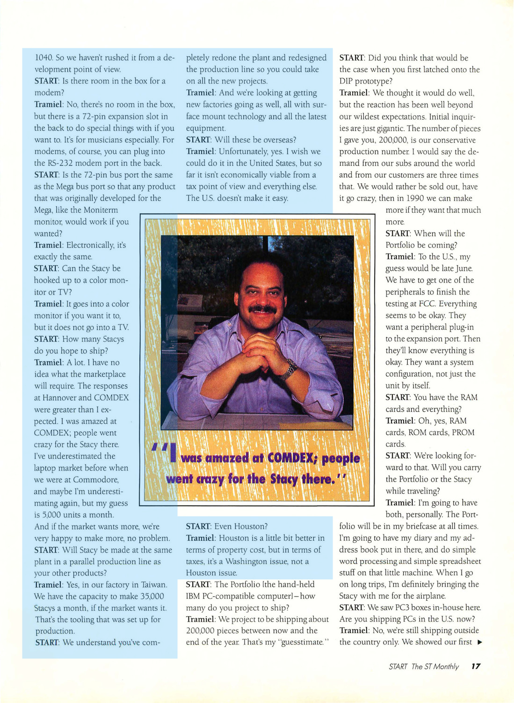

Atari STacy
===========
Overview
--------

The STacy was Atari's first attempt at a portable ST computer. It was announced in 1987, shortly after the [Mega ST](atari_mega_st.md), with which the STacy shares a lot of its architecture, came to market. However, it took until 1989 for the STacy to become available.

- - - -

Features
--------

Compared to an original 520ST, the STacy had the following additional features:

* Built-in monochrome screen
* [Shadow](http://tho-otto.de/hypview/hypview.cgi?url=%2Fhyp%2Fchips_x.hyp&charset=UTF-8&index=479) LCD Driver chip with 32KB [VRAM](https://web.mit.edu/6.115/www/document/62256.pdf) 
* Blitter
* SCSI (Same as the [Mega STe](atari_mega_ste.md))
* TOS 1.04
* Integrated trackball
* Internal 720K Floppy Drive
* Optional internal SCSI Hard Drive
* Internal speaker and volume control
* Internal RTC

- - - -

Development
-----------

The STacy started li

- - - -

Models
------

The STacy had three model names; `STacy`, `STacy 2`, and `STacy 4`, with the number denoting the amount of installed RAM. The plain `STacy` had only 1 MB.

There were, however, more models and configurations than that. The `Model ID`, found on a sticker on the bottom, reveals the actual configuration it came with from the Taiwanese factory. It's broken down like this:

**LST-
        4** - The amount of RAM in MB
      **1** - How many internal Floppy Drives (max two).
**4** - The size of the Hard Drive; 4 = 40 MB, 2 = 20 MB, 0 = No HD
**4** - Common number present in all STacy models and configurations.

While twin floppy drive models are known to exist, by far the most common configuration was the single floppy drive with an internal hard drive.

|Model Name|STacy   |STacy 2 |STacy 2 |STacy 4 |
|----------|--------|--------|--------|--------|
|Model ID  |LST-1104|LST-2204|LST-2124|LST-4144|
|RAM       |1 MB    |2 MB    |2 MB    |4 MB    |
|Floppy    |One 3.5"|Two 3.5"|One 3.5"|One 3.5"|
|Hard Drive|N/A     |N/A     |20 MB   |40 MB   |

Note: Every memory configuration came with its own `daughterboard` or `sub-pcb`.

* 1 MB: This PCB has the 1 MB soldered on in 8 x 1 Mbit DIP chips. Not expandable without significant DIY skills.
* 2 MB: This PCB has the 2 MB soldered on in 16 x 1 Mbit SIP chips. Expandable to 4 MB with two 1 MB [SIPP](https://en.wikipedia.org/wiki/SIPP_memory) sticks.
* 4 MB: This PCB has the 4 MB soldered on in 32 x 1 Mbit SIP chips.

- - - -

Compatibility
-------------

#### TOS

The TOS 1.04 that the STacy was shipped with is byte-identical to the TOS 1.04 on other models. It was speculated, that the Shadow chip would require additional signals and instructions to drive the LCD. That is not the case.

Note: This means that TOS 2.06 upgrades designed for other systems should also work on the STacy. An example is shown [here](http://www.atariancomputing.com/blog/ataristacytos206upgrade).

Since the STacy supports 28 pin [mask ROMs](https://en.wikipedia.org/wiki/Mask_ROM), it is possible to install factory TOS 1.04 chips from another systems by just replacing the chips. This is useful if one wants to change the language of the TOS. This was confirmed by [Atarian Computing](https://www.atariancomputing.com) in the [Atari STacy Users](https://www.facebook.com/groups/371886416598852/) Facebook group. They were also able to confirm the the STacy booted up with TOS 1.02 ROMs. 

#### Accelerators

The STacy is known to work several accelerators. Most notably the PAK3-030. ICD's ADSpeed has also been a popular upgrade since the very beginning.

- - - -

Specifications
--------------

|           |Atari STacy Technical Details|
|----------:|-------------|
|OS   | TOS 1.04 (2x [TC571001](https://datasheet.datasheetarchive.com/originals/distributors/Datasheets-X2/DSA627000207.pdf) or 28pin 1Mbit OTP ROM  |
| CPU          |  	Motorola [68HC000](https://en.wikipedia.org/wiki/Motorola_68000#CMOS_versions) @ 8 MHz           |
|RAM   | 1MB, 2MB, or 4MB  |
|Storage   | 3.5" floppy drive, 3.5" SCSI hard drive Conner CP3020 (20 MB) or CP3040 (40 MB) |
|Display   |10.4" EPSON LCD passive matrix backlight   |
| Sound  | Yamaha YM-2149, three channels, 8 octaves  |
|Input   |   |
| Power  |   |
|Dimensions   |   |
|   |   |

- - - -

Articles
--------

- - - -

#### ST World - Issue 46 - Dec 1989

- - - -

#### START - Sep 1989

- - - -

Images
------

- - - -

References
----------
[1. Chips 'n' Chips](http://tho-otto.de/hypview/hypview.cgi?url=%2Fhyp%2Fchips_x.hyp&hideimages=0&hidemenu=0&charset=utf8) 

- - - -

External Links
--------------
