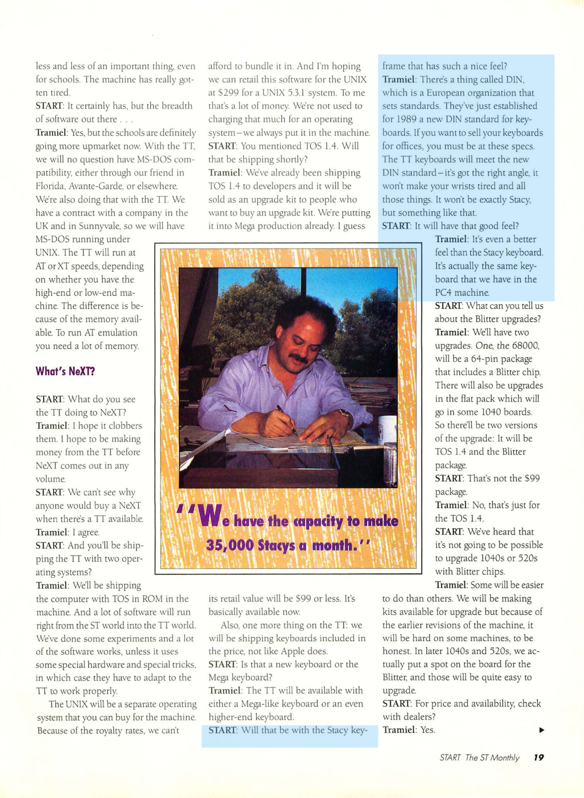

Atari STacy
===========
Overview
--------

The STacy was Atari's first attempt at a portable ST computer. It was announced in 1987, shortly after the [Mega ST](atari_mega_st.md), with which the STacy shares a lot of its architecture, came to market. However, it took until 1989 for the STacy to become available.

- - - -

Distinguishing Features
-----------------------

Compared to an original 520ST, the STacy had the following additional features:

* Built-in monochrome screen
* [Shadow](https://ataripedia.github.io/wiki/developer/chips/Shadow.png) #3 @tes LCD Driver chip with 32KB VRAM 
* Blitter
* SCSI (Same as the [Mega STe](atari_mega_ste.md))
* TOS 1.04
* Integrated trackball
* Internal 720K Floppy Drive
* Optional internal SCSI Hard Drive
* Internal speaker and volume control

- - - -

Development
-----------

- - - -

Models
------

- - - -

Specifications
--------------

- - - -

Articles
--------

- - - -

#### ST World - Issue 46 - Dec 1989

- - - -

#### START - Sep 1989

- - - -

Images
------

- - - -

References
----------

- - - -

External Links
--------------
